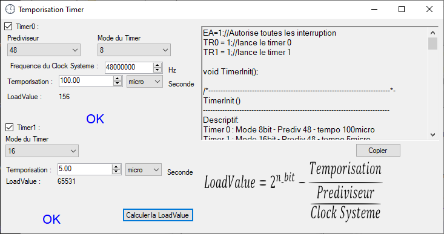

# CFPT Utility
## But
aider les élèves du CFPT a développer des projets avec le microcontrôleur C8051F38C (et C8051F320)

## Cadre du développement
Ce projet a été réalisé pendant mon temps libre durant les deux ans de technicien.

## Menu de login :
(il est possible d'utiliser l'application en mode hors ligne)

## Menu principal :

## Configuration des timers :

## Configuration des interruptions :

## Configuration de l'ADC :

